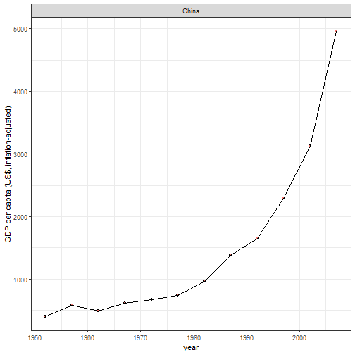

Shiny app pitch: A reactive shiny app utilising Gapminder data (R dataset)
========================================================
author: Richard Hardy
date: 2020-02-01 
autosize: true

Investigating changes in Gross Domestic Product and life expectancy globally
========================================================


This app has two parts:

**Part 1:** 

- The app displays countries' GDP per capita and life expectancy in years from birth as recorded across 5-year intervals between 1952 and 2007. 

- Moving the slider (or clicking through using the right arrowkey), reveals the [general improvements in health and wealth](https://www.youtube.com/watch?v=hVimVzgtD6w) globally over the second half of the 20th century.

**Part 2:** 

- Select a country of interest and the app returns a line plot of the GDP per capita for that country over time, as well as the percentage change in GDP per capita from 1952 to 2007. Similarly for life expectancy.


========================================================
**Part 1: sample output for 1952**

- The world plot displays countries by continent, with bubble size an indication of their population. The example below is produced by setting the slider to 1952.


***

- A note on the dataset: continents include Oceania, containing Australia and New Zealand in this dataset. These two countries are omitted from the global view.


========================================================
**Part 2: Sample output: China**

- GDP per capita and life expectancy are shown over time when a country is selected from the dropdown menu. Selecting 'China' from the country box produces the following GDP plot for China. 



***

- The app also returns from a reactive expression, the % change in GDP between 1952 and 2007, given as: 


```
[1] "% 1138.39"
```

- Thank you for watching and I hope you enjoy exploring the Gapminder data with this app

- Hans Rosling's TED talk is the inspiration for this project, and ` r ?gapminder` will give the source code used to build the global plot. 
Enjoy!


========================================================
**reactive expression code in server.R : GDP change (%) calculation**


```r
shinyServer(function(input, output) {
    
   percentchange <- reactive({
        
       countryInput <- input$country
       (gapminder$gdpPercap[gapminder$country == 
        as.character(countryInput) & gapminder$year == 2007] -
        gapminder$gdpPercap[gapminder$country == 
        as.character(countryInput) & gapminder$year == 1952] ) / 
        gapminder$gdpPercap[gapminder$country == 
        as.character(countryInput) & gapminder$year == 1952] * 100
                
    })
})
```
