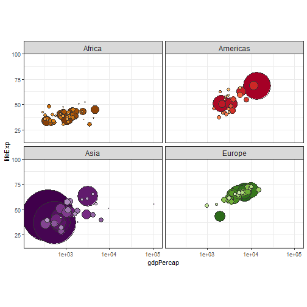

Week 4 Assessment pitch: A reactive shiny app using R's Gapminder data
========================================================
author: Richard Hardy
date: 2020-01-31 
autosize: true

Gobal Changes in Gross Domestic Product and Life Expectancy 
========================================================


This app functions in two parts:

**Part 1:** 

- The app displays countries' GDP per capita and Life expectancy in years from birth as recorded across 5-year intervals between 1952 and 2007. 

- By moving the slider (or by clicking the right arrowkey to move forward through time), the app displays the general improvements in health and wealth globally.

**Part 2:** 

- By selecting a country of interest, the app returns a line plot of the GDP per capita for that country over time, as well as the percentage change in GDP per capita from 1952 to 2007, the whole time range of the data.


========================================================
**Part 1: sample output for 1952**

- The world plot displays countries by continent, with bubble size as an indication of their population. This is controlled by the slider for your chosen year.



***

- Oceania contains Australia and New Zealand in this dataset, these two countries are omitted from part 1.


========================================================
**Part 2: Sample output: China**

- Selecting 'China' from the country box produces the following plot of GDP per capita over time


***


- The app also returns the % change in GDP between 1952 and 2007 as:


```
[1] 1138.39
```

- The code to produce this calculation within Shiny is shown on the final slide.


Thank you for watching.


========================================================
**reactive code chunk in server.R : % change calculation**


```r
shinyServer(function(input, output) {
    
   percentchange <- reactive({
        
       countryInput <- input$country
       (gapminder$gdpPercap[gapminder$country == 
        as.character(countryInput) & gapminder$year == 2007] -
        gapminder$gdpPercap[gapminder$country == 
        as.character(countryInput) & gapminder$year == 1952] ) / 
        gapminder$gdpPercap[gapminder$country == 
        as.character(countryInput) & gapminder$year == 1952] * 100
                
    })
})
```
